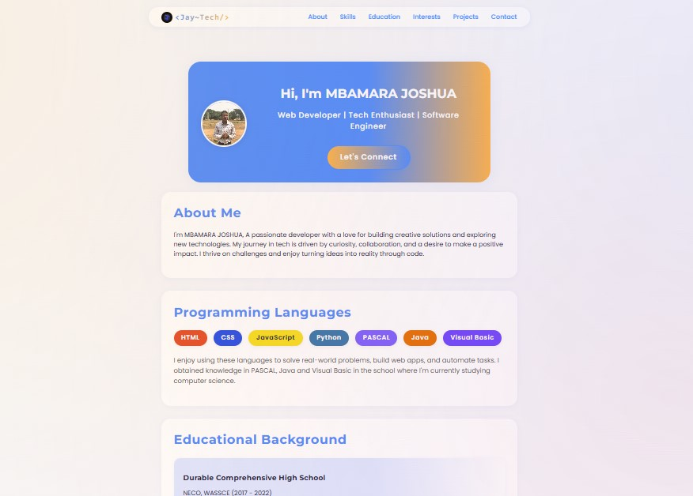

# Mbamara Joshua's Portfolio Website

Welcome to my personal portfolio! Crafted with creativity, color, and care for the PLP Academy Hackathon. My nickname is <Jay~Tech/>, and you'll spot it throughout the site.

## 🖼️ Preview

## 🚀 Features
- Distinct header with my nickname and navigation bar
- Hero section with profile image and tagline
- Playful, professional, and fully responsive design
- Programming Languages section with colorful badges
- About Me section
- Educational Background with downloadable CV (PDF)
- Interests section
- Projects section with interactive project buttons
- Contact form (mailto:techjay2023@gmail.com)
- Social icons for Mail, LinkedIn, GitHub, Twitter, and Facebook (PNG images)
- Modern cards, gradients, and creative UI touches
- Google Fonts: Poppins (body), Montserrat (headings)

## 🎨 Design Inspiration
This site blends playful gradients, modern cards, and a clean layout inspired by top developer portfolios. The font pairing of Poppins (body) and Montserrat (headings) gives a fresh, professional feel.

## 🌐 See It Live!

Step into my world of code and creativity—no setup required!  
Check out the live portfolio, now deployed with ❤️ on Vercel:

👉 [https://jaytech-portfolio.vercel.app](https://jaytech-portfolio.vercel.app)

Browse, explore, and get inspired—my work is just a click away!

## 🛠️ Usage

1. Open `index.html` in your browser to view the site locally.
2. Use the navigation bar to explore sections like About, Projects, and Contact.
3. Download my CV from the Education section.
4. Try the contact form to send me a message.
5. Click the project buttons to learn more about my work.

## 📄 License
This project is open source for learning and inspiration. Feel free to fork, share, or adapt with credit.

---

> Created by Mbamara Joshua (<Jay~Tech/>) for the PLP Academy Hackathon. All code is original and follows the competition guidelines. If you like what you see, feel free to connect! I hope to win the prize.
